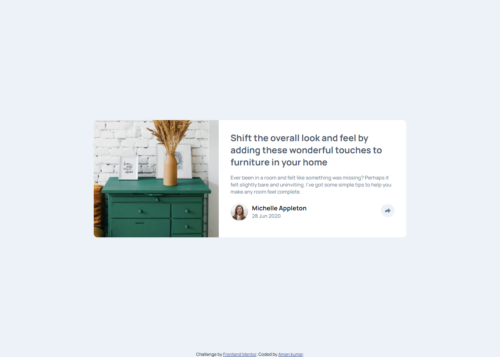

# Frontend Mentor - Article preview component solution

## Table of contents
  - [Screenshot](#screenshot)
  - [Links](#links)
- [My process](#my-process)
  - [Built with](#built-with)
  - [What I learned](#what-i-learned)
- [Author](#author)
- [Acknowledgments](#acknowledgments)

### Screenshot

### Links

- Solution URL: [Add solution URL here](https://your-solution-url.com)
- Live Site URL: [Add live site URL here](https://your-live-site-url.com)

## My process

### Built with

- Semantic HTML5 markup
- CSS custom properties
- Flexbox
- Mobile-first workflow
- [js](classes and eventlistener) 

### What I learned

i learn some new things like , adding comment is really important and i practiced with this project

## Author

- Website - [Add your name here](https://www.your-site.com)
- Frontend Mentor - [@amankumar1222](https://www.frontendmentor.io/profile/amankumar1222)
- Twitter - [@DemandHere](https://twitter.com/DemandHere)

